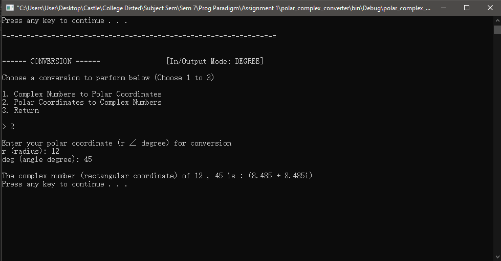

# polar-complex-calculator

This is a small assingment C++ console interface program built to process calculation and conversion involving Polar Coordinates and Complex Numbers.

## Project Requirements and Objectives

- able to convert a complex number to rectangular coodinate back to the user and vice versa.
- simple arithmetic operations (add, subtract, multiply, divide) should be allowed for both polar coordinate and complex number in the program, user will enter 2 value (both value can be polar coordinate or complex number, a mix of them are not required). The resulted value after artihmetic operation will be displayed back to the user.
- able to determine if two polar coordinate are the same, for example the polar coordinates (1, 45°) and (-1,225°) are actually equal.
- able to input a polar coordinate and a complex number, and then determine if they are actually equal or not.
- For Polar coordinate input, the program must also be able to accept the arguments of the polar coordinates in degrees or radian measure.

## Screenshots

- Main Menu
  

- Convert Complex Number to Polar Coordinates
  

- Convert Polar Coordinates to Complex Number
  

- Check two equivalence of two polar coordinates
  

- Check equivalence of a polar coordinate and a complex number
  

- Artihmetic on two complex numbers
  

- Artihmetic on two polar coordinates
  

- Change MODE Input/Output value (Radian/Degree)
  

